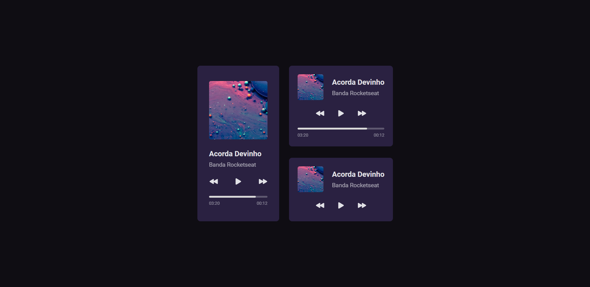

<h1 align="center"> boraCodar #01 - Music Player </h1>

Projeto desenvolvido no desafio do #boraCodar da Rocketseat  

  <a href="#-technologies">Technologies</a>&nbsp;&nbsp;&nbsp;|&nbsp;&nbsp;&nbsp;
  <a href="#-project-features">Project features</a>&nbsp;&nbsp;&nbsp;|&nbsp;&nbsp;&nbsp;
  <a href="#-layout">Layout</a>&nbsp;&nbsp;&nbsp;|&nbsp;&nbsp;&nbsp;
  <a href="#-licence">Licença</a>

  

 

  

---

## 🚧 Project features

- [X] Responsive
- [ ] Play and pause music
- [ ] Progress bar
- [ ] Progressive and regressive timer

## 🛠 Technologies

## 🎨 Layout

You can access the original layout using [this link](https://www.figma.com/community/file/1195050524500542670).

## 📋 Licence

This project is under the IMT license
